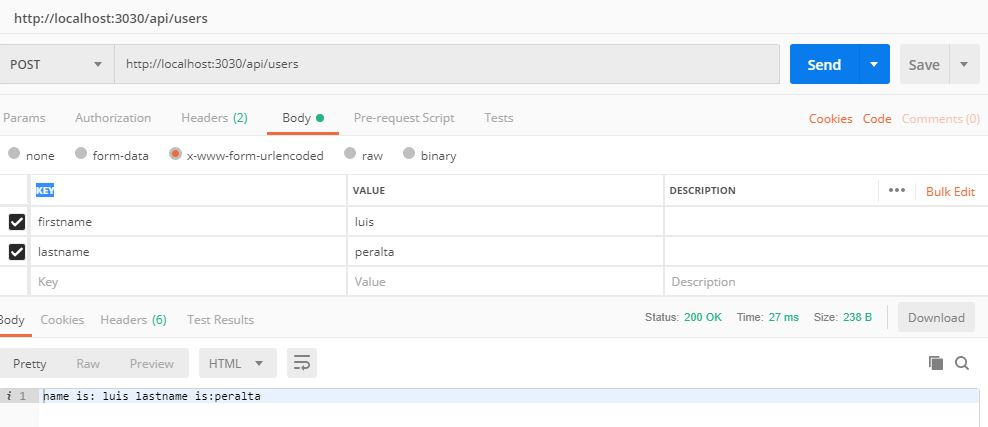

# How to connect services

To connect JavaScript, MongoDB and NodeJS follow this steps

## JavaScript

The following code is to generate a simple form with the required data

```javascript
<!DOCTYPE html>
<html>
<body>
	<form method="POST" action="http://localhost:3030/api/users" enctype="application/x-www-form-urlencoded">
	  First name:<br>
	  <input type="text" name="firstname" value="Mickey">
	  <br>
	  Last name:<br>
	  <input type="text" name="lastname" value="Mouse">
	  <br><br>
	  <input type="submit" value="Submit">
	</form> 
</body>
</html>
```

**Code explanation**:

- `method` => the HTTP verb could be POST/GET/PUT/DELETE or whatever you want, but for security reasons it must be POST
- `action` => this is the url (setup within `NodeJS`) for the POST method
- `enctype` => "encryption type" would be the declared in the code
- `name` => are the name of the variables that must catch in NodeJS app

## NodeJS

The following code is an example of how to setup NodeJS with custom `endpoints`

```javascript

// grab the packages we need
var express = require('express');
var app = express();
var port = 3030;

var bodyParser = require('body-parser');
app.use(bodyParser.urlencoded({ extended: true })); // support encoded bodies
app.use(bodyParser.json()); // support json encoded bodies


// routes will go here

// POST http://localhost:3030/api/users
// parameters sent with 
app.post('/api/users', function(req, res) {
    var firstname = req.body.firstname;
    var lastname = req.body.lastname;
    res.send('name is: ' + firstname + ' lastname is:' + lastname);
    console.log(req.body);
});


// start the server
app.listen(port);
console.log('Server started! At http://localhost:' + port);
```

## MongoDB

TBD

Missing points

- How to serve HTML pages on specific endpoints
- How to connect to mongoDB to do actions: queries, inserts, ... etc.

# How to test services

## POSTMAN

To test the endpoint `http://localhost:3030/api/users` previously created in `NodeJS` with POSTMAN follow the next steps

1. Open a new tab
2. Change the HTTP verb to `POST` method
3. Introduce the URL `http://localhost:3030/api/users`
4. Select `Body` tab  and select `x-www-form-urlencoded`
5. Type the Keys and values proper for the request
6. Click on send button

Example:

