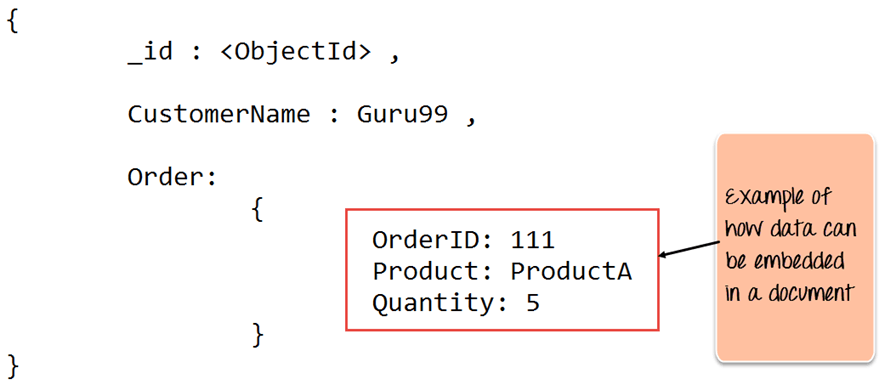
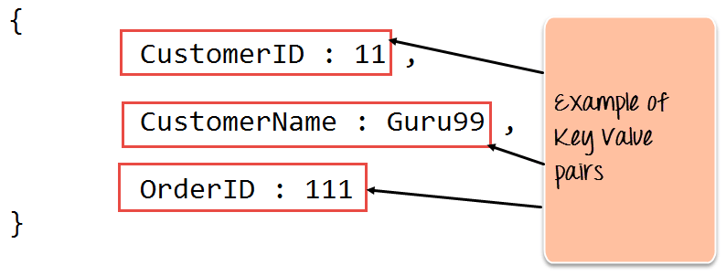
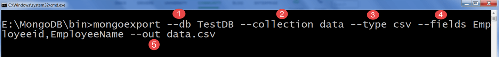
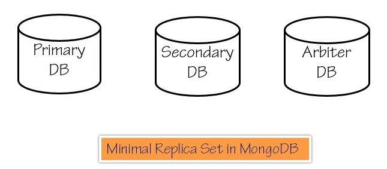
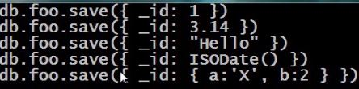
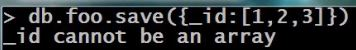

# MongoDB

## What is mongoDB?

MongoDB is a document-oriented NoSQL database used for high volume data storage. MongoDB is a database which come into light around the mid-2000s. It falls under the category of a NoSQL database.

## MongoDB Example

The below example shows how a document can be modeled in MongoDB



1. The `_id` field is added by MongoDB to uniquely identify the document in the collection.
2. What you can note is that the order data (OrderID, Product, and Quantity) which in RDBMS will normally be stored in a separate table, while in MongoDB is actually stored as an embedded document in the collection itselft. This is one of the key differences in how data is modeled in MongoDB.

## Key Components of MongoDB Architecture

Below are a few of the common terms used in MongoDB

1 - `id` => This is a field required in every MongoDB document. The `_id` field represents a unique value in the MongoDB document. The `_id` field is like the document's primary key (referencing to SQL databases). If you create a new document without and `_id` field, MongoDB will automatically create the field. So for example, if we see the example of the above customer table, MongoDB will add a *24 digit unique identifier* to each document in the collection.

| _id                      | CustomerID | CustomerName | OrderID |
| ------------------------ | ---------- | ------------ | ------- |
| 563479cc8a8a4246bd27d784 | 11         | Customer1    | Order1  |
| 563479cc7a8a4246bd47d784 | 12         | Customer2    | Order2  |

2 - `Collection` => This is a grouping of MongoDB documents. A collection is the equivalent of a table which is created in any other RDMS such as oracle or SQL Server. A collection exists within a single database. As seen from the introduction collections don't enforce any sort of structure.

3 - `Cursor` => This is a pointer to the result of set of a query, Clients can iterate through a cursor to retrieve results.

4 - `Database` => This is a container for collections like in RDMS wherein it is a container for tables, Each database gets its own set of files on the file system. A MongoDB server can store multiple databases.

5 - `Document` => A record is an MongoDB is basically called a document, The document, it turn, will consist of field name and values.

6 - `Field` => A name-value pair in a document. A document has zero or more fields. Fields are analogous to columns in relational databases. The following diagram shows an example of Fields with Key value pairs. So in the example below CustomerID and 11 is one of the key value pair's defined in the document.



7 - `JSON` => This is know as `JavaScript` Object Notation. This is a human-readable, plain text format for expressing structured data. JSON is currently supported in many programming languages.

## Why Use MongoDB?

Below are the few of the reasons as to why one should start using MongoDB

1. Document-oriented – Since MongoDB is a NoSQL type database, instead of having data in a relational type format, it stores the data in documents. This makes MongoDB very flexible and adaptable to real business world situation and requirements.
2. Ad hoc queries - MongoDB supports searching by field, range queries, and regular expression searches. Queries can be made to return specific fields within documents.
3. Indexing - Indexes can be created to improve the performance of searches within MongoDB. Any field in a MongoDB document can be indexed.
4. Replication - MongoDB can provide high availability with replica sets. A replica set consists of two or more mongo DB instances. Each replica set member may act in the role of the primary or secondary replica at any time. The primary replica is the main server which interacts with the client and performs all the read/write operations. The Secondary replicas maintain a copy of the data of the primary using built-in replication. When a primary replica fails, the replica set automatically switches over to the secondary and then it becomes the primary server.
5. Load balancing - MongoDB uses the concept of sharding to scale horizontally by splitting data across multiple MongoDB instances. MongoDB can run over multiple servers, balancing the load and/or duplicating data to keep the system up and running in case of hardware failure.

## Data Modelling in MongoDB

As we have seen from the Introduction section, the data in MongoDB has a flexible schema. Unlike in[ SQL ](https://www.guru99.com/sql.html)databases, where you must have a table's schema declared before inserting data, MongoDB's collections do not enforce document structure. This sort of flexibility is what makes MongoDB so powerful.

When modeling data in Mongo, keep the following things in mind

1. What are the needs of the application – Look at the business needs of the application and see what data and the type of data needed for the application. Based on this, ensure that the structure of the document is decided accordingly.
2. What are data retrieval patterns – If you foresee a heavy query usage then consider the use of indexes in your data model to improve the efficiency of queries.
3. Are frequent insert's, updates and removals happening in the database – Reconsider the use of indexes or incorporate sharding if required in your data modeling design to improve the efficiency of your overall MongoDB environment.

## NoSQL Tutorial: Learn NoSQL Features, Types, What is, Advantages

Please read about this topic [here](https://www.guru99.com/nosql-tutorial.html)

# Importing databases

1 - Create a CSV file called data.csv and put the following data in it

```tex
Employeeid,EmployeeName
1, Natan
2, Mohan
3, Smith
```

So in the above example, we are assuming we want to import 3 documents into a collection called data. The first row is called the header line which will become the Field names of the collection.


**Code Explanation:**

1. We are specifying the db option to say which database the data should be imported to
2. The type option is to specify that we are importing a csv file
3. Remember that the first row is called the header line which will become the Field names of the collection, that is why we specify the `–headerline` option. And then we specify our data.csv file.

## Exporting databases

Exporting MongoDB is done by using the mongoexport command



**Code Explanation:**

1. We are specifying the db option to say which database the data should be exported from.
2. We are specifying the collection option to say which collection to use
3. The third option is to specify that we want to export to a csv file
4. The fourth is to specify which fields of the collection should be exported.
5. The –out option specifies the name of the csv file to export the data to.

# Setup

## Download

:link: [=> mongoDB](https://www.mongodb.com/download-center/community)

## Environment variable

Add to `PATH` the mongoDB binaries

## Configuration file

Create a configuration file `mongod.conf`

```bash
# Where data files will reside
dbpath=<somePath>
# Where the log file will be stored
logpath=<somePath>/<logFileName>.log
# How to verbose the server will be logging (1-5)
verbose=vvvvv
```

## Running mongoDB

Run mongo with the `daemon`

```bash
$ mongod -f <configuration_file>.conf
```

## Install as a service

e.g when the machine starts, this applies for windows

```bash
mongod -f <configuration_file>.conf --install
```

To start mongodb as a services type the following command

```bash
net start mongodb
```

To check if the mongodb service is up and running type the following command

```bash
net start | findstr Mongo
```

To stop mongodb type the following command

```bash
net stop mongod
```

## Create a new database

In MongoDB default database is test. If you didn't create any database, then collections will be stored in test database


```bash
> use DATABASE_NAME
```

To check the current database type:

```bash
> db
```

To check all databases type:

```bash
show dbs
```

*At this point your database will not show in the above command because to display a database it needs at least one document into it*.

*In others words, the database is not created until it has some information*

To show commands related the database type:

```bash
db.<databaseName>.help()
```


:link: [mongoDB create databases](https://www.tutorialspoint.com/mongodb/mongodb_create_database.htm)​

## Verify the connection

```bash
$ mongo
MongoDB shell version v4.0.6
connecting to: mongodb://127.0.0.1:27017/?gssapiServiceName=mongodb
Implicit session: session { "id" : UUID("6ef3e1d5-5796-4470-80d8-33ab6b19af9a") }
MongoDB server version: 4.0.6
```

> `27017` is the port that mongoDB uses

## Database is Namespace

1. Connect to mongoDB typing `mongo`
2. Show the databases typing `show dbs`
   1. The `local` database is for mongo use, don't touch
3. Show the current database typing `db` (by default is `test`)
4. Specific a database typing `use <databaseName>`

## Replica Sets

The following is the *MINIMUM REPLICATE SET POSSIBLE MODEL*

The members of a replica set are:



Roles for each member

- `Primary DB`
  - Is the only and only readable instance, that's means that all the connections must be in this database for write any content, any attempts to write to `secondary DB` will fail
- `Secondary DB`
  - It is a only read instance and its a smaller machine
  - You can have many secondary databases as you want
  - To have `secondary databases` provides scalability because you can perform many more reads against the replicas ("secondary databases") rather than attacking a single server with all your request
  - Here the data will be replicated from the `primary database` eventually
  - `Automatic recovery option`: if in some point the `primary database` crash one of the `secondary databases` will take over and become as the `primary database`
  - If one of the `secondary databases` fail, there is not a big deal since you have the `primary database` running
  - To have a `secondary database` there will not it assures you *NO DATA LOSS* and functionality 
- `Arbiter DB`
  - An arbiter does *not* have a copy of data set thus *cannot* become a `primary database`
  - Replica sets may have arbiters to add a vote in `elections for primary`
  - Arbiters always have exactly *1* election vote, and thus allow replica sets to have an uneven number of voting members without the overhead of an additional member that replicates the data
  - The replica set cannot process write operations until the election completes successfully, the median time before a cluster elects a new primary should not typically exceed 12 seconds
  - *IMPORTANT*: `Do not run an arbiter on systems that also host the primary or the secondary members of the replica set`

The ideal model for `replica set` is to be run into different servers to protect the information for a system machine failure

References:

:link: [Replica set arbiter](https://docs.mongodb.com/manual/core/replica-set-arbiter)​

:link: [Replication](https://docs.mongodb.com/manual/replication)​

### Set minimal replica set model in one machine

#### Creation

1 - Create 3 directories

```bash
mkdir -p <directory>\primary <directory>\backup <directory>\arbiter
```

2 - Create the databases (this step applies for windows and it could be different on Mac os/ Linux systems)

```bash
> @REM Primary
> start "primaryDB" mongod --dbpath <directory>\primary --logpath <directory>\primary\<primaryDB>.log --port 3000 --replSet "demo"
> @REM Secondary
> start "backupDB" mongod --dbpath <directory>\backup --logpath <directory>\backup\<backupDB>.log --port 4000 --replSet "demo"
> @REM Arbiter
>start "arbiter" mongod --dbpath <directory>\arbiter --logpath <directory>\arbiter\<arbiter>.log --port 5000 --replSet "demo"
```

> Where:
>
> `port` => define a different port for each database since they will run in the same system (which is not recommend)
>
> `replSet` => sets the name of `replicate set` where the primary, secondary and arbiter will be participating

The above commands will open 3 terminals, one for each one, at this point they don't know match

Notice that you can add more options to `start` command like more verbosite `--verbose vvvvv`

Note: *each time you reboot the machine this steps needs to be performed in order to start the servers*

#### Configuration file

Every time you start the machine you have to perform the previous step unless you define a configuration files for each one, e.g:

```bash
$ cat primary.config
port=3000
dbpath=primary
logpath=primary/primary.log
verbose=vvvvv
replSet=demo

$ cat secondary.config
port=4000
dbpath=secondary
logpath=secondary/secondary.log
verbose=vvvvv
replSet=demo

$ cat arbiter.config
port=5000
dbpath=arbiter
logpath=arbiter/arbiter.log
replSet=demo
```

and you have to call them in the following way:

```bash
> mongod -f primary.config
> mongod -f secondary.config
> mongod -f arbiter.config
```

and now you can enter to any database you want, e.g:

```bash
> mongo --port 3000
```


#### Configuration

1 - Connect to primary database

```bash
> mongo --port 3000
```

> `TIP`: if you want to know which server are connect type `db.getMongo()`

2 - Define the replica set model (define a JavaScript object)

```javascript
let demoConfig = {
    _id: "demo",
    "members": [
        {
            "_id": 0,
            "host": "localhost:3000",
            "priority": 10
        },
        {
            "_id": 1,
            "host": "localhost:4000"
        },
        {
            "_id": 2,
            "host": "localhost:5000",
            "arbiterOnly": true
        }
    ]
}
```

> Which:
>
> `_id: "demo"` => its the `--replSet demo` parameter 
>
> `priority: 10` => the higher priority will get more voting, more votes and its more likely to become to primary


- Notes: 

  - The mongo shell is a `JavaScript` interpreter
  - Assigned priority of 10 and not assigned priority to the other will warranty that localhost 30000 will become to primary

  3 - Initialize the replication

  ```bash
  > rs.initiate(demoConfig)
  ```

  :link: [*Know Issue*](https://stackoverflow.com/questions/32636451/errmsg-bad-digit-while-parsing-port-30000-code-93)

  If you have an error with the step 3, redefine the object as follow and try it again

  ```javascript
  demoConfig = { "_id": "demo", "members": [ { "_id": 0, "host": "localhost:3000", "priority": 10 }, { "_id": 1, "host": "localhost:4000" }, { "_id": 2, "host": "localhost:5000", "arbiterOnly": true } ] }
  ```

  The output will be:

  ```text
  > rs.initiate(demoConfig)
  {
          "ok" : 1,
          "operationTime" : Timestamp(1552683355, 1),
          "$clusterTime" : {
                  "clusterTime" : Timestamp(1552683355, 1),
                  "signature" : {
                          "hash" : BinData(0,"AAAAAAAAAAAAAAAAAAAAAAAAAAA="),
                          "keyId" : NumberLong(0)
                  }
          }
  }
  demo:SECONDARY>
  demo:PRIMARY>
  ```

  after some time, type enter to show the current database as `PRIMARY`

4 - Insert a dummy value into primary database

```bash
db.foo.save({_id:1, value:"hello world"})
```

> Where:
>
> - `_id:1` => its an identifier

If you save another register with the same `_id`, the previous register will update

5 - Setup the backup database

5.1  - Connect to backup database

```bash
mongo --port 4000
```

At this point you are not able to perform any query due to this database needs to be configured as `slave`, by default `slave` is false

5.2 - Configurate the backup database as slave

```bash
> db.getMongo().setSlaveOk()
```

6 - Read the value from the `primary database`

```bash
db.foo.find()
```

> Note:
>
> - Every time you access to `backup` database you will perform the step 5.2

#### Test Failover 

1 - Making `backup datase` as *PRIMARY*

Simply close the window for `primary database` to make the backup turns as `primary database` after some seconds (12 seconds to be exact)

You can check this connecting to this database and the prompt will shows as *PRIMARY*

2 - Come alive again to `primary database` (which is in the port 3000)

```bash
> start "primaryDB" mongod --dbpath <directory>\primary --port 3000 --replSet "demo"
```

3 - Connect back to secondary

You can see now that the prompt has changed again to `SECONDARY`

#### Replication Status

To know about the `replication model status` type the command:

```bash
rs.status()
```

> More commands with `rs.help()`
>
> - `rs` stands for replication status

# The Mongo Shell

## eval command line option

### Detach option

Syntax's

```bash
mongo <server>/<database> --eval "command"
```

Example:

```bash
mongo localhost/admin --eval "printjson(db.runCommand({logRotate:1}))"
```

> Where:
>
> `admin` => is the database to connect for administrative operations
>
> `printjson function` => returns a json

### Interactive option

```bash
monogo <server> <script.js> --shell
```


## Run a JavaScript

Syntax's

```bash
mongo <server> <javaScript.js>
```

Example:

The `JavaScript` code

```javascript
let userCount = function(){
    let count = db.Users.count();
    let entry = {_id: Date(), n: count};
    db.UserCountHistory.save(entry);
    print("\nToday's User Count:" + entry.n)
};
userCount();
```

The execution:

```bash
> mongo localhost script.js
```

## Users creation

For user creation please read the following post

:link: [How to create users in mongoDB](https://www.guru99.com/mongodb-create-user.html)

# Saving Data

mongo does not have any schema to store the data because it's not a relational database

## Rules

1. A document must have and *_id* field, if not mongo will assign one
   1. The size of document in mongo currently is limited to 60MB, if you need more than that you have to do it through several documents

## Collections

Collections are *analogous* to tables in relational databases

- The collection insert will be only visible through of the database from which was inserted

Example:

1 - create a collection into `foo database`

```bash
> use foo
> db.fooCollection.save({"_id":1, value: "hello world"})

```

> Where:
>
> - `db` => means operate in the current database
> - fooCollection => the name of the collection
> - save => means save a record in the current database

 2 - show the current database collections

```bash
> show collections
foorCollection

```

If you run the above command into another database it will not shows the `fooCollection`

## Document Id

The data types for `Id` field supports are:



The only data type exclude is an array:



## Object Id

Now we know that every record needs to has an `object id`, but it you do not specify it mongo will assign a random `object id`, e.g:

```bash
> use foo
> db.users.save({Name: 'Bob'})
> db.users.find()
{ "_id" : ObjectId("5c98eb74ade48a7abe016e60"), "Name" : "Bob" }
```

> Where:
>
> - `db` => refers to the current database which is `foo` 
>
> - `users` => refers to the collection ""`table"` where the results will be saved (if does not exists mongo will create it)
>
> - `find()` => its a function to find all the records in a collection

* *ObjectId()* it is a function that you can use from the shell in order to get a random`object id`
* *ObjectId()* contains a `method` to get their timestamp, `ObjectId().getTimestamp()`, this is very useful to avoid created another field that contains the document creation time, you have that in the `ObjectId()` 

## Insert

Mongo allows to insert a document with the same Id

```bash
> use foo
> db.users.save({_id:1, Name: 'Bob'})
> db.users.save({_id:1, Name: 'Sinclair'})
> db.users.find()
{ "_id" : 1, "Name" : "Sinclair" }
```


But this is not an insert totally, is likely as `modified`, if you need to be sure that the document will be *insert* only if the `Id` does not exists, use `insert` command instead because the `save` command will overwrite the document:

```bash
> use foo
> db.users.insert({_id:1, Name: 'Bob'})
> db.users.insert({_id:1, Name: 'Sinclair'})
WriteResult({
        "nInserted" : 0,
        "writeError" : {
                "code" : 11000,
                "errmsg" : "E11000 duplicate key error collection: foo.users index: _id_ dup key: { : 1.0 }"
        }
})
```

> The first example can we take as `Insert some document with an Id` to perform some operations e.g: if you took the email address as an id, when some user try to insert the database with the same email address you can show an error in frontend due to *`insert` command does not allow duplicates*

## Update

`Save` command it not safe for updating documents, because it does not has concurrency and in the situation where two clients needs to update the same document id, one may be overwriting the document that the other has already write.

`Update` command prevent this situation and only allow to update *one by one*, the syntaxes is the following:


> Where:
>
> - `options` => parameter is optional

Example:

```bash
> db.a.save({_id:1, x:10})
> db.a.update({_id:1}, {$inc:{x:1}} )
> db.a.find()
{ "_id" : 1, "x" : 11 }
```

> Where:
>
> - `a` => its the collection
>
> - `$inc` => its a mongo function that takes two arguments, the first is the key to increment and the second is the value to increment

### Set

`Set` command is used (along with `update` command) to *add a new field* (key-value) to the document that does not exists on it, e.g:

```bash
> db.a.update({_id:1}, {$set:{y:3}} )
{ "_id" : 1, "x" : 11, "y" : 3 }
```

### Unset

`Unset` command is used to *remove a field* (key-value) in the collection, e.g:

```bash
> db.a.update({_id:1}, {$unset:{y:''}} )
{ "_id" : 1, "x" : 11 }
```

> Where:
>
> - `''` => is to indicate that the field `y` will be removed, also it could has a *0* as value

### Rename

`Raname` command is used to update *keys* (not values), e.g:

```bash
> db.a.update({_id:1}, {$rename:{'Naem':'Name'}} )
```

### Push (for array operations)

`Push` command it used to insert the values as a list (as an array), and update that list in the second call, e.g:

```bash
> db.a.update({_id:1}, {$push: {things: 'one'} })
> db.a.find()
{ "_id" : 1, "Name" : "bob", "things" : [ "one" ] }
> db.a.update({_id:1}, {$push: {things: 'two'} })
> db.a.find()
{ "_id" : 1, "Name" : "bob", "things" : [ "one", "two" ] }
```

The disadvantages of `push` command is that if you push some repeated element, `push` command will insert in the document and maybe this is something that we do not want, to prevent that we can use the `set` operator *which means add elements only if they does not exists in the array*

### addToSet (for array operations)

As comment before in `push` command this command will add elements only if they does not exists in the array, e.g:

```bash
> db.a.update({_id:1}, {$addToSet: {things: 'two'} })
```

### Pull (for array operations)

To remove a element(s) from an array, you can use `pull` command

```bash
> db.a.update({_id:1}, {$pull: {things: 'two'} })
```

You can use many times you want, since it will only remove once the element

### Pop (for array operations)

To remove the last element in an array

```bash
> db.a.update({_id:1}, {$pop: {things: 1} })
```


To remove the first element in an array

```bash
> db.a.update({_id:1}, {$pop: {things: -1} })
```

### Multi Update (for array operations)

To update all documents in a collection (add a new entry in a specific array) you can the following sentence:

```bash
> db.a.update( {}, {$addToSet: {things: '4'}}, {multi:true})
```

> Where:
>
> - `{}` => means that matches with all *IDs*
> - things => is the key to update
> - `4` => the value to insert
> - `multi:true` => by default only the first key in the collection will be updated, with this option means that all keys must update as well

To update specific arrays with a criteria:

```bash
> db.a.update( {things:2}, {$addToSet: {things: '42'}},  {multi:true})
```

> Where:
>
> - `{things:2}` => means that only will be update the keys that contains in their array the value of  `2`

### Find and Modify (for array operations)

To affect exactly one record `find and modify` command will does the trick, the following is the signature of the command:


>  Where:
>
> - `foo` => is the collection to modify
> - `query` => the condition to search
> - `update` => the value to update
> - `upsert` => if set to `true` mean that if there is not record exists with the criteria, this will create it
> - `remove` => meaning that remove the document that matches with this criteria but delete exactly one record
> - `new` => it will return the record to update from the database, by default it will return the version of the document before the change was made with, if set to `true` it will return the version of document *after* the change was made
> - `sort` => to sort the returned value, for example with a value of `-1` the sort command will sort in descending order (the last element), and with the value of `1` will sort in ascending order (the first element), *this affect too the way to modify the results*
> - `fields` => return only a part of the document

Example:

1 - Create a new collection with the following documents

```bash
> db.a.save({_id:1, things:[1,2,3]})
> db.a.save({_id:2, things:[2,3]})
> db.a.save({_id:3, things:[3]})
> db.a.save({_id:4, things:[1,3]})
```

2 - Create the following object for `find and modify`

```javascript
mod = {
    "query":{
        "things": 1
    },
    "update":{
        "$set":{
            "touched": true
        }  
    },
    "sort": {
        "_id": -1
    }
}
```

3 - Run the command `find and modify`

```bash
> db.a.findAndModify(mod)
{ "_id" : 4, "things" : [ 1, 3 ] }
```

Because the `sort` was setup to `-1` this affect to the last "things" array that contains the value 1 on it (descending order), if the `sort` was setup to `1` this will be affect to the first "things" with the value `1` on the array (ascending order)

Note: set the `new` to be true, will returns the record after it was modified: `mod.new = true`

# Finding Documents

## Find()

The `find()` command signature is the following


> Where:
>
> - `query` => its a filter, it defines the matching criteria to run against the documents
> - `projection` => defines which part of these document should be return (this is an optional parameter)

Example of query (Equality):

```bash
> db.animals.find({_id:1})
```

> Where:
>
> - `animals` = > collection name
> - `{_id:1}` => find only the document with the `_id:1`

Example of query *+* projection:

```bash
> db.animals.find({_id:1}, {_id:1})
```

In `projection` could be either inclusion or exclusion, in the above example we used inclusion to only retrieve the `_id:1` in the result

## Comparison

Some examples:

```bash
> db.animals.find({_id: {$gt:5} }, {_id:1})
> db.animals.find({_id: {$gte:5} }, {_id:1})
> db.animals.find({_id: {$lt:5} }, {_id:1})
> db.animals.find({_id: {$lte:5} }, {_id:1})
> db.animals.find({_id: {$gt:2, $lt:4} }, {_id:1})
```

> Where:
>
> - `gt` => means greater than ..
> - `gte` => means greater than or equal than ...
> - `lt` => means less than ...
> - `lt`e => means less than or equal than ...

### Negation

```bash
> db.animals.find({_id: {$not: {$gt:5} }}, {_id:1})
```

### In

```bash
> db.animals.find({_id: {$in: [1, 3] }, {_id:1})
```

The above sentence means that will find only elements with `Ids` of values 1 and 3 (inclusion)

```bash
> db.animals.find({_id: {$nin: [1, 3] }, {_id:1})
```

The above sentence means that will find only elements with `Ids` of values not in 1 and 3 (exclusion)

## Arrays

The following is an example of many

```bash
> db.animals.find( {tags: {$in: ['cute', 'ocean']}} )
```

The above command will find all the documents that contains `tags` field with the values `cute` or `ocean`

To get `cute` and `ocean` you can use the following command:

```bash
> db.animals.find( {tags: {$all: ['cute', 'ocean']}} )
```

To exclude some arrays values we can use the following command:

```bash
> db.animals.find( {tags: {$nin: ['cute']}} )
```

## Dot Notation

To find a document inside another document (a json inside another json), e.g:

The following document:

```javascript
{
    "info":{
        "canFly": true
    }
}
```

To find the field (value) in the mentioned document the following sintax is needed

```bash
> db.animals.find({"info.canFly": true})
```

## Exists

The `exists` mongo function will check if a subdocument or document exists, e.g:

```bash
> db.animals.find( {"info.canFly": {$exists: true}} )
```

The above command will return all the documents that have the subdocument `canFly`, if set to false, it will return all documents that does not have that subdocument

## More Projection

To be more specific with `find()` command in `projection` options we can do the following

For retrieve only specific fields (include)

```bash
> db.animals.find({_id:1}, {_id:1, name:1})
```

> Where:
>
> - `1` => this value means that the fields with this value will be included

To exclude fields

```bash
> db.animals.find({_id:1}, {_id:0, name:0})
```

> Where:
>
> - `0` => this value means that the fields with this value will be excluded

Note: 

1. If you have to exclude the field `_id` you must specified with a value of `0` otherwise you will get all the fields 
2. You cannot mix and match, you will only allow to perform either `include` or `exclude`, otherwise mongo will shows an error

## Sorting the results

To sort the results we can use the `sort()` function

```bash
> db.animals.find({_id:1}, {_id:0, name:0}).sort({_id:-1})
```


## Limit the results

To limit the number of results we can use `limit` function like this to return only 2 results:

```bash
> db.animals.find({_id:1}, {_id:0, name:0}).limit(2))
```

## Skip

To skip elements we can use `skip()` function

```bash
> db.animals.find({_id:1}, {_id:0, name:0}).skip(1).limit(2))
```


## findOne

The `findOne()` function will return exactly one result:

```bash
> db.animals.findOne({_id:1})
```


# Indexes

## Good examples

Please visit [Working with indexes](https://www.guru99.com/working-mongodb-indexes.html) to see a very good explanation regarding how to understanding the indexes

# Tools

The Studio 3T (before "Robomongo") it is a graphical interface to manage the database

[Studio 3T](https://robomongo.org)

Mongo Compass

[Compass](https://www.mongodb.com/download-center/compass)

# Course in PluralSight

[MongoDB Table of contents](https://app.pluralsight.com/library/courses/mongodb-introduction/table-of-contents)