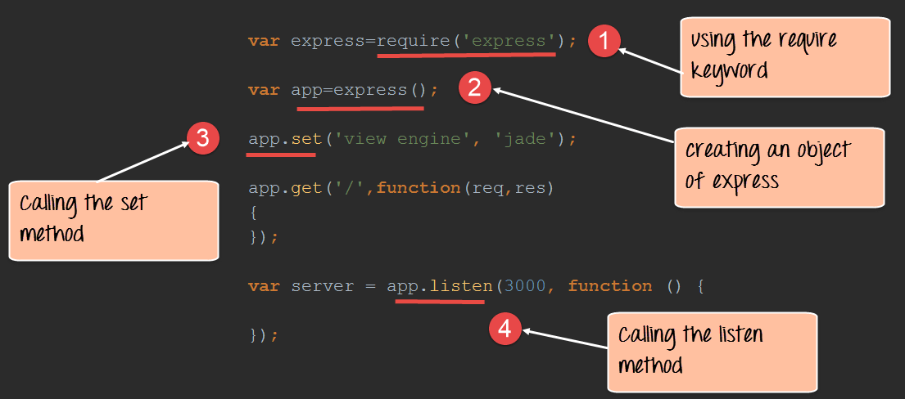
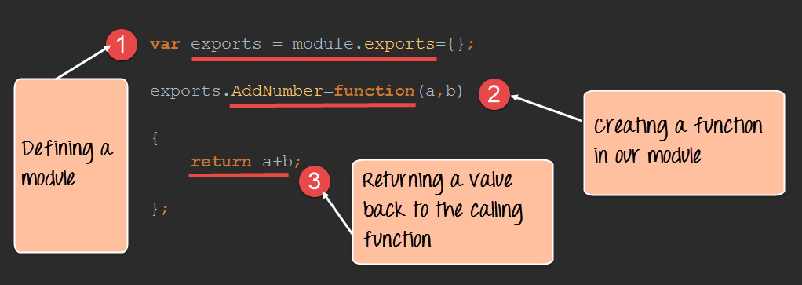
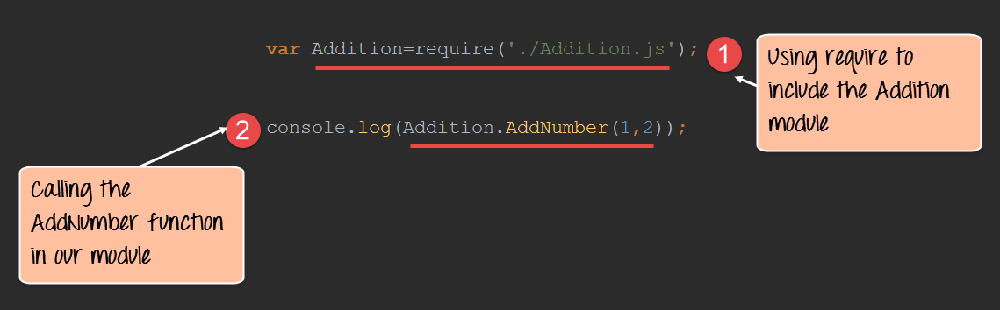
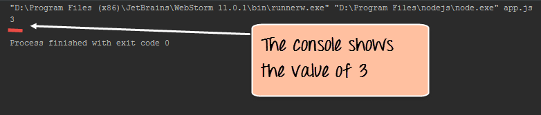
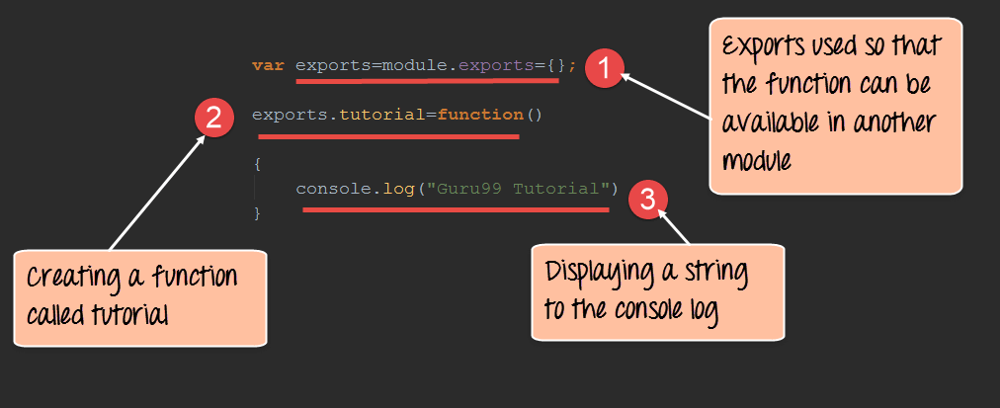
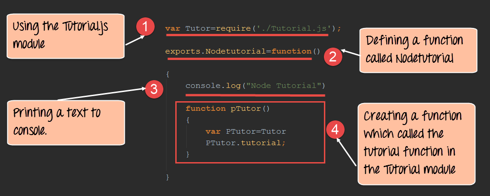
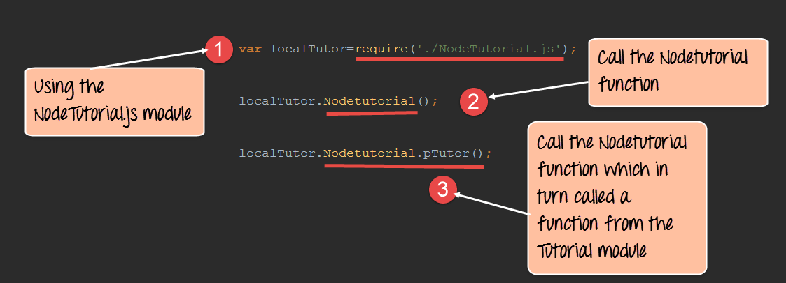

# Node.Js

## Introduction

The modern web application has really come a long way over the years with the introduction of many popular frameworks such as bootstrap, Angular JS, etc. All of these frameworks are based on the popular[ JavaScript ](https://www.guru99.com/interactive-javascript-tutorials.html)framework.

But when it came to developing server based applications there was just kind of a void, and this is where Node.js came into the picture.

Node.js is also based on the JavaScript framework, but it is used for developing server-based applications

## What is node.js?

Node.js is an open-source, cross-platform runtime environment used for development of server-side web applications. Node.js applications are written in JavaScript and can be run on a wide variety of operating systems.

Node.js is based on an event-driven architecture and a non-blocking Input/Output API that is designed to optimize an application's throughput and scalability for real-time web applications.

## Create a example webserver

1 - Create a file `webserver.js` with the following content

```javascript
var http = require('http');

http.createServer(function (req, res) {
    res.writeHead(200, {'Content-Type': 'text/html'});
    res.end('Hello World!');
    console.log("hellow");
}).listen(8080);
```

**Code Explanation:**

1. The basic functionality of the "require" function is that it reads a[ JavaScript ](https://www.guru99.com/interactive-javascript-tutorials.html)file, executes the file, and then proceeds to return an object. Using this object, one can then use the various functionalities available in the module called by the require function. So in our case, since we want to use the functionality of http and we are using the require(http) command.
2. In this 2nd line of code, we are creating a server application which is based on a simple function. This function is called, whenever a request is made to our server application.
3. When a request is received, we are asking our function to return a "Hello World" response to the client. The writeHead function is used to send header data to the client and while the end function will close the connection to the client.
4. We are then using the server.listen function to make our server application listen to client requests on port no 7000. You can specify any available port over here.

2 - Execute the code

```bash
> node webserver.js
```

3 - Output

In your browser go to `localhost:8080` and hit enter, you will see the message `hello world`

## What are modules in Node.js?

As stated earlier, modules in Node js are a way of encapsulating code in a separate logical unit. There are many readymade modules available in the market which can be used within Node js.

Below are some of the popular modules which are used in a Node js application

1. **Express framework** – Express is a minimal and flexible Node js web application framework that provides a robust set of features for the web and[ Mobile ](https://www.guru99.com/mobile-testing.html)applications.
2. **Socket.io** - Socket.IO enables real-time bidirectional event-based communication. This module is good for creation of chatting based applications.
3. **Jade** - Jade is a high-performance template engine and implemented with[ JavaScript ](https://www.guru99.com/interactive-javascript-tutorials.html)for node and browsers.
4. **MongoDB** - The[ MongoDB ](https://www.guru99.com/mongodb-tutorials.html)Node.js driver is the officially supported node.js driver for MongoDB.
5. **Restify** - restify is a lightweight framework, similar to express for building REST APIs
6. **Bluebird** - Bluebird is a fully featured promise library with focus on innovative features and performance

## Using modules in Node.js

*A prerequisite is to type the command `npm init` to create the `package.json` file*

In order to use modules in a Node.js application, they first need to be installed using the Node package manager.

The below command line shows how a module "express" can be installed.

```bash
> npm install express
```

- The above command will download the necessary files which contain the "express modules" and take care of the installation as well
- Once the module has been installed, in order to use a module in a Node.js application you need to use the 'require' keyword. This keyword is a way that Node.js uses to incorporate the functionality of a module in an application.

Let's look at an example how we can use the "require" keyword. The below code example shows how to use the require function



```javascript
var express=require('express');
var app=express();
app.set('view engine','jade');
app.get('/',function(req,res)
{
});
var server=app.listen(3000,function()
{
});
```

1. In the first statement itself, we are using the "require" keyword to include the express module. The "express" module is an optimized JavaScript library for Node.js development. This is one of the most commonly used Node.js modules.
2. After the module is included, in order to use the functionality within the module, an object needs to be created. Here an object of the express module is created.
3. Once the module is included using the "require" command and an "object" is created, the required methods of the express module can be invoked. Here we are using the set command to set the view engine, which is used to set the templating engine used in Node.js.
4. Here we are using the listen method to make the application listen on a particular port number.

### Creating NPM modules

Node.js has the ability to create custom modules and allows you to include those custom modules in your Node.js application.

Let's look at a simple example of how we can create our own module and include that module in our main application file. Our module will just do a simple task of adding 2 numbers.

Let's follow the below steps to see how we can create modules and include them in our application.

**Step 1)** Create a file called "Addition.js" and include the below code. This file will contain the logic for your module.

Below is the code which would go into this file;




```javascript
var exports=module.exports={};
exports.AddNumber=function(a,b)
{
return a+b;
};
```

1. The "exports" keyword is used to ensure that the functionality defined in this file can actually be accessed by other files.
2. We are then defining a function called 'AddNumber'. This function is defined to take 2 parameters, a and b. The function is added to the module "exports" to make the function as a public function that can be accessed by other application modules.
3. We are finally making our function return the added value of the parameters.

Now that we have created our custom module which has the functionality of adding 2 numbers. It's now time to create an application, which will call this module.

In the next step, we will actually see how to create the application which will call our custom module.

**Step 2)** Create a file called "app.js," which is your main application file and add the below code



```javascript
var Addition=require('./Addition.js');
console.log(Addition.AddNumber(1,2));
```

1. We are using the "require" keyword to include the functionality in the Addition.js file.
2. Since the functions in the Addition.js file are now accessible, we can now make a call to the AddNumber function. In the function, we are passing 2 numbers as parameters. We are then displaying the value in the console.



**Output**:

- When you run the app.js file, you will get an output of value 3 in the console log.
- The result is because the AddNumber function in the Addition.js file was called successfully and the returned value of 3 was displayed in the console.

### Extending modules

When creating modules, it is also possible to extend or inherit one module from another.

In modern day programming, it's quite common to build a library of common modules and then extend the functionality of these common modules if required.

Let's look at an example of how we can extend modules in Node.js.

**Step 1)** Create the base module.

In our example, create a file called "Tutorial.js" and place the below code.

In this code, we are just creating a function which returns a string to the console. The string returned is "Guru99 Tutorial".



```javascript
var exports=module.exports={};
exports.tutorial=function()
{
console.log("Guru99 Tutorial")
}
```

1. The exports module is used so that whatever function is defined in this file can be available in other modules in Node.js
2. We are creating a function called tutorial which can be used in other Node.js modules.
3. We are displaying a string "Guru99 Tutorial" in the console when this function is called.

Now that we have created our base module called Tutorial.js. It's now time to create another module which will extend this base module.

We will explore how to do this in the next step.

**Step 2)** Next we will create our extended module. Create a new file called "NodeTutorial.js" and place the below code in the file.



```javascript
var Tutor=require('./Tutorial.js');
exports.NodeTutorial=function()
{
console.log("Node Tutorial")
function pTutor()
{
var PTutor=Tutor
PTutor.tutorial();
}
}

Or

var Tutor=require('./Tutorial.js');
exports.NodeTutorial=function()
{
console.log("Node Tutorial")
this.pTutor = function ()
{
var PTutor=Tutor
PTutor.tutorial();
}
}
```

Note, the following key points about the above code

1. We are using the "require" function in the new module file itself. Since we are going to extend the existing module file "Tutorial.js", we need to first include it before extending it.
2. We then create a function called "Nodetutorial." This function will do 2 things,

- It will send a string "Node Tutorial" to the console.
- It will send the string "Guru99 Tutorial" from the base module "Tutorial.js" to our extended module "NodeTutorial.js".

1. Here we are carrying out the first step to send a string to "Node Tutorial" to the console.
2. The next step is to call the function from our Tutorial module, which will output the string "Guru99 Tutorial" to the console.log.

**Step 3)** Create your main app.js file which is your main application file and include the below code.



```javascript
var localTutor=require('./NodeTutorial.js');
localTutor.NodeTutorial();
localTutor.NodeTutorial.pTutor();

Or use this code

var tut = new localTutor.NodeTutorial();  // Create and save object
tut.pTutor();  // Call function on object
```

The above code does the following things;

1. Our main application file now calls the "NodeTutorial" module.
2. We are calling the "NodeTutorial" function. By calling this function, the text "Node Tutorial" will be displayed in the console log.
3. Since we have extended our Tutorial.js module and exposed a function called pTutor. It also calls the tutorial module in the Tutorial.js module, and the text "Guru99 Tutorial" will be displayed to the console as well.

**Output:**

Since we have executed the above app.js code using Node, we will get the following output in the console.log file

- Node Tutorial
- Guru99 Tutorial

## Managing third party packages with npm

As we have seen, the "Node package manager" has the ability to manage modules, which are required by Node.js applications.

Let's look at some of the functions available in the node package manager for managing modules

1 - Installing packages in global mode – Modules can be installed at the global level, which just basically means that these modules would be available for all Node.js projects on a local machine. The example below shows how to install the "express module" with the global option.

**npm install express –global**

The global option in the above statement is what allows the modules to be installed at a global level.

2 - Listing all of the global packages installed on a local machine. This can be done by executing the below command in the command prompt

**npm list --global**

Below is the output which will be shown, if you have previously installed the "express module" on your system.

Here you can see the different modules installed on the local machine.

3 - Installing a specific version of a package – Sometimes there may be a requirement to install just the specific version of a package. Once you know what is the package and the relevant version that needs to be installed, you can use the npm install command to install that specific version.

The example below shows how to install the module called underscore with a specific version of 1.7.0

npm install **underscore@1.7.0**

4 - Updating a package version – Sometimes you may have an older version of a package in a system, and you may want to update to the latest one available in the market. To do this one can use the npm update command. The example below shows how to update the underscore package to the latest version

**npm update underscore**

5 - Searching for a particular package – To search whether a particular version is available on the local system or not, you can use the search command of npm. The example below will check if the express module is installed on the local machine or not.

**npm search express**

6 - Un-installing a package – The same in which you can install a package, you can also un-install a package. The uninstallation of a package is done with the uninstallation command of npm. The example below shows how to uninstall the express module

**npm uninstall express**