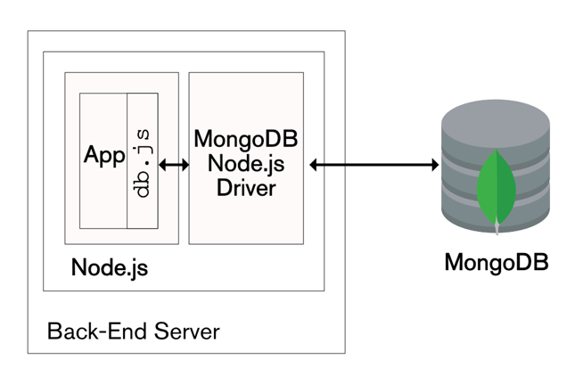

# Connecting Services

## Overview

In this step-by-step document you will be able to connect your HTML webpages to perform operations into a database such as, insert new records, search for records  updating records and more.

To accomplish this we need to understand the following picture



`HTML` webpages needs of `JavaScript` in order to interact with  `mongodb,` this communication is possible with `nodejs` which is the one in charge to perform it.

## Software requirements

### Programs

| #    | Name       | Summary                                                      | Link                                                         |
| ---- | ---------- | ------------------------------------------------------------ | ------------------------------------------------------------ |
| 1    | mongoDB    | is a *No SQL database*                                       | [Download](https://www.mongodb.com/download-center/community) |
| 2    | NodeJS     | is a `JavaScript` in server side                             | [Download](https://nodejs.org/en/download)                   |
| 3    | nodemon    | is a tool that helps develop node.js based applications by automatically restarting the node application when file changes in the directory are detected | [Download](https://www.npmjs.com/package/nodemon)            |
| 4    | TypeScript | It is a superset of `JavaScript`                             | [Download](https://www.typescriptlang.org/)                  |

> Note: to install `nodemon` & `typescript` you need to have a `package.json` in the root directory, typing `npm init` (after NodeJS installation) will generate it | [npm init reference](https://docs.npmjs.com/cli/init)

### IDE

The `IDE` to be used here will be *Visual Studio Code* because it has support for `TypeScript` language with other kindness

[Download Visual Studio Code](https://code.visualstudio.com/download)

## Folder structure

Create the following folders

```bash
$ mkdir -p ts/database ts/services js html
```

`ts` stand for TypeScript files

Where:

- `ts/database`: will be the folder to contains the file(s) in order to establish the connection with `mongodb`
- `ts/services`: will be the folder to contains the file(s) in order to create a *[Rest full API](<https://searchmicroservices.techtarget.com/definition/RESTful-API>)*
- `js`: will be the folder to contains the `JavaScript` files
- `html`:  will be the folder to contains the `HTML`/`CSS`

### `ts` folder

This folder will contains the file `tsconfig.json`, this file is needed by `Visual Studio Code` to know how the *TypeScript* files will be compiled.

> The browser does not understand about TypeScript files, for this reason we need to compile our files in order to convert them to JavaScript files. The main advantage of TypeScript is that being a superset of `JavaScript` will let us know about possible errors in real time to debug more exactly